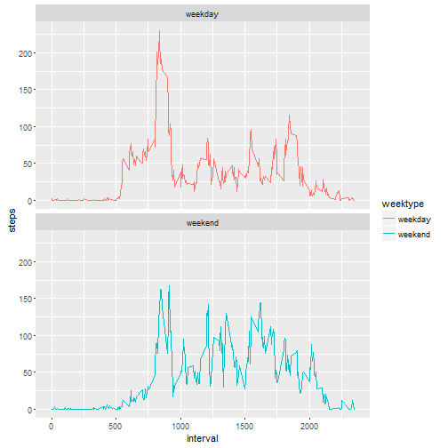

## Include various libraries

```r
library(knitr)
opts_chunk$set(echo = TRUE)

library(dplyr)
library(lubridate) #for date 
library(ggplot2)   #for plotting
```

## Loading and preprocessing the data
The code checks for activity.zip file. If it is not present then it is downloaded from the given URL into the working directory. Then the zipped file is unzipped and read as csv into 'data'.

```r
fileurl <- "https://d396qusza40orc.cloudfront.net/repdata%2Fdata%2Factivity.zip"
zipName <- "activity.zip"

if(!file.exists(zipName)){
  download.file(fileUrl,zipName)
}

fName <- unzip(zipName, files= NULL, list = FALSE)
data <- read.csv(fName, header=TRUE, sep=",",colClasses = c("numeric", "character",
                                                                "integer"))
```
The data is made tidy by converting the date field using the lubridate package into ymd format. Str and head are used to check the summary of the data.

```r
data$date <- ymd(data$date)

#check the data
str(data)
```

```
## 'data.frame':	17568 obs. of  3 variables:
##  $ steps   : num  NA NA NA NA NA NA NA NA NA NA ...
##  $ date    : POSIXct, format: "2012-10-01" "2012-10-01" ...
##  $ interval: int  0 5 10 15 20 25 30 35 40 45 ...
```

```r
head(data)
```

```
##   steps       date interval
## 1    NA 2012-10-01        0
## 2    NA 2012-10-01        5
## 3    NA 2012-10-01       10
## 4    NA 2012-10-01       15
## 5    NA 2012-10-01       20
## 6    NA 2012-10-01       25
```


## What is mean total number of steps taken per day?
The code filters out the missing data and then summarizes the total no. of steps taken on each day. 

```r
steps <- data %>%
  filter(!is.na(steps)) %>%
  group_by(date) %>%
  summarize(steps = sum(steps)) %>%
  print
```

```
## Source: local data frame [53 x 2]
## 
##          date steps
##        (time) (dbl)
## 1  2012-10-02   126
## 2  2012-10-03 11352
## 3  2012-10-04 12116
## 4  2012-10-05 13294
## 5  2012-10-06 15420
## 6  2012-10-07 11015
## 7  2012-10-09 12811
## 8  2012-10-10  9900
## 9  2012-10-11 10304
## 10 2012-10-12 17382
## ..        ...   ...
```

This code uses ggplot for making the histogram of steps per day.

```r
ggplot(steps, aes(x = steps)) +
  geom_histogram(fill = "firebrick", binwidth = 1000) +
  labs(title = "Histogram of Steps per day", x = "Steps per day", y = "Frequency")
```


It calculates the mean and median of steps per day and displays the result.

```r
mean_steps <- mean(steps$steps, na.rm = TRUE)
median_steps <- median(steps$steps, na.rm = TRUE)

mean_steps
```

```
## [1] 10766.19
```

```r
median_steps
```

```
## [1] 10765
```

The mean steps is 10766.19.
The median steps is 10765

## What is the average daily activity pattern?
The code calculates the mean of steps taken for each 5 minute interval across all days. A time series plot of 5 minute interval and the average no. of the steps taken is prepared using ggplot.

```r
interval <- data %>%
  filter(!is.na(steps)) %>%
  group_by(interval) %>%
  summarize(steps = mean(steps))

ggplot(interval, aes(x=interval, y=steps)) +
  geom_line(color = "firebrick")
```


The following code calculates the 5 minute interval which has the highest average no. of steps taken across all days.

```r
interval[which.max(interval$steps),]
```

```
## Source: local data frame [1 x 2]
## 
##   interval    steps
##      (int)    (dbl)
## 1      835 206.1698
```
The interval 835 has, on average, the highest count of steps, with 206 steps.

## Imputing missing values
The following code checks the no. of missing values in dataset

```r
sum(is.na(data$steps))
```

```
## [1] 2304
```
There are 2304 records with missing data.

The code fills missing data by using mean of same 5-minute interval

```r
data_full <- data
nas <- is.na(data_full$steps)
avg_interval <- tapply(data_full$steps, data_full$interval, mean, na.rm=TRUE, simplify=TRUE)
data_full$steps[nas] <- avg_interval[as.character(data_full$interval[nas])]
```

check for no missing values results 0 missing values.

```r
sum(is.na(data_full$steps))
```

```
## [1] 0
```

This code calculates daily total no. of steps taken with missing value replaced by daily average no of steps.

```r
steps_full <- data_full %>%
  filter(!is.na(steps)) %>%
  group_by(date) %>%
  summarize(steps = sum(steps)) %>%
  print
```

```
## Source: local data frame [61 x 2]
## 
##          date    steps
##        (time)    (dbl)
## 1  2012-10-01 10766.19
## 2  2012-10-02   126.00
## 3  2012-10-03 11352.00
## 4  2012-10-04 12116.00
## 5  2012-10-05 13294.00
## 6  2012-10-06 15420.00
## 7  2012-10-07 11015.00
## 8  2012-10-08 10766.19
## 9  2012-10-09 12811.00
## 10 2012-10-10  9900.00
## ..        ...      ...
```

This code plots histogram of steps taken if 5 minute interval with missing data are filled in.

```r
ggplot(steps_full, aes(x = steps)) +
  geom_histogram(fill = "firebrick", binwidth = 1000) +
  labs(title = "Histogram of Steps per day, including missing values", x = "Steps per day", y = "Frequency")
```


Calculate the mean and median steps with the filled in values:

```r
mean_steps_full <- mean(steps_full$steps, na.rm = TRUE)
median_steps_full <- median(steps_full$steps, na.rm = TRUE)

mean_steps_full
```

```
## [1] 10766.19
```

```r
median_steps_full
```

```
## [1] 10766.19
```
 After missing data are imputed, the mean and median of total no. of steps in 5 minute interval are equat ot the same value of 10766.


## Are there differences in activity patterns between weekdays and weekends?
A factor variable weektype is introduced to indicate weekday or weekend using the mutate 

```r
data_full <- mutate(data_full, weektype = ifelse(weekdays(data_full$date) == "Saturday" | weekdays(data_full$date) == "Sunday", "weekend", "weekday"))
data_full$weektype <- as.factor(data_full$weektype)
head(data_full)
```

```
##       steps       date interval weektype
## 1 1.7169811 2012-10-01        0  weekday
## 2 0.3396226 2012-10-01        5  weekday
## 3 0.1320755 2012-10-01       10  weekday
## 4 0.1509434 2012-10-01       15  weekday
## 5 0.0754717 2012-10-01       20  weekday
## 6 2.0943396 2012-10-01       25  weekday
```

This code calculates average steps in 5-minute interval for weekdays and weekends and makes time-series plot of 5-minute interval and the average no. of steps taken for weekdays and weekends.

```r
interval_full <- data_full %>%
  group_by(interval, weektype) %>%
  summarize(steps = mean(steps))
s <- ggplot(interval_full, aes(x=interval, y=steps, color = weektype)) +
  geom_line() +
  facet_wrap(~weektype, ncol = 1, nrow=2)
print(s)
```


